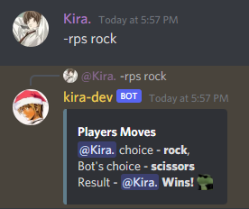

# Rock Paper Scissors Bot

A discord bot for playing rock paper scissors with a computer :shipit:

## How to use it ?

To use the bot follow the following steps:

1. Clone this repository

   ```bash
   git clone git@github.com:Kira272921/local-hack-day-build-2022.git
   ```

2. Navigate into the `Rock Paper Scissors` directory

   ```bash
   cd src
   cd "Day 2"
   cd "Rock Paper Scissors"
   ```

3. Install the dependencies

   ```bash
   pip install -r requirements.txt
   ```

4. Make the `run.sh` file executable

   ```bash
   chmod u+x run.sh
   ```

5. Starting the bot

   ```bash
   ./run.sh
   ```

## Demo



Have any issues while using the bot ? Raise an issue and i'll look over it
