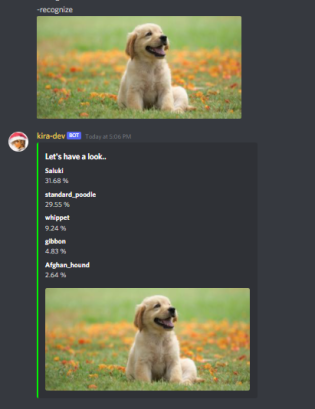
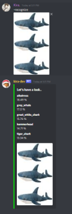

# Rock Paper Scissors Bot

## How to use it ?

To use the bot follow the following steps:

1. Clone this repository

   ```bash
   git clone git@github.com:Kira272921/local-hack-day-build-2022.git
   ```

2. Navigate into the `Image recognizing bot` directory

   ```bash
   cd src
   cd "Day 5"
   cd "Image recognizing bot"
   ```

3. Install the dependencies

   ```bash
   pip install -r requirements.txt
   ```

4. Make the `run.sh` file executable

   ```bash
   chmod u+x run.sh
   ```

5. Starting the bot

   ```bash
   ./run.sh
   ```

## Demo





[](https://www.youtube.com/watch?v=MUkm8gzDNpM)

Have any issues while using the bot ? Raise an issue and I'll look over it
